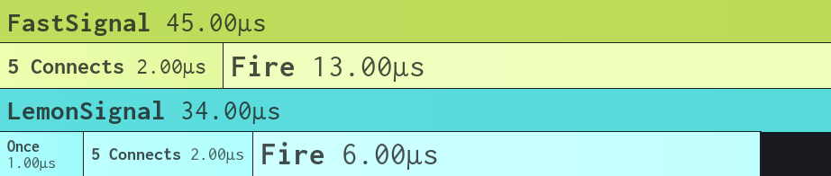
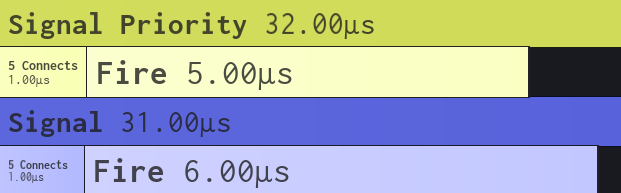

# Signal

## Installation

### Pesde

```bash
pesde add molyidev/signal
```

### Wally

```toml
Signal = "molyidev/signal@^1.0.2"
```

## Why use Signal?

* **Fully typed:** Designed to work with the new Luau type solver.
* **Priority:** Includes a `PrioritySignal` variant, allowing you to control the exact execution order of your connections.
* **Performance:** Uses a **Doubly Linked List** for O(1) removal and **LIFO** cleanup structure.
* **GC Friendly:** Designed to have minimal memory allocation.

## Usage

### Basics

```lua
local Signal = require(path.to.Signal)

-- Create a standard signal
local signal = Signal.new()

-- Connect to the signal
local connection = signal:Connect(function(msg)
    print("Received:", msg)
end)

-- Fire the signal
signal:Fire("Hello World!") 

-- Clean up
connection:Disconnect()
```

### Priority Signal

```lua
local Signal = require(path.to.Signal)

local prioritySignal = Signal.newPriority()

-- Priority 10 (Runs second)
prioritySignal:ConnectPriority(10, function()
    print("Second")
end)

-- Priority 0 (Runs first)
prioritySignal:ConnectPriority(0, function()
    print("First")
end)

prioritySignal:Fire()
-- Output:
-- First
-- Second
```

### Type Checking

```lua
local Signal = require(path.to.Signal)

-- Define a signal that accepts a number and a string
local signal = Signal.new() :: Signal.Signal<number, string>

signal:Connect(function(num, text)
    -- 'num' is inferred as number
    -- 'text' is inferred as string
    print(num, text)
end)

signal:Fire(10, "str") -- Valid
signal:Fire("str", 10) -- Type Error
```

### Synchronous Firing

By default, `Fire` runs listeners in separate threads. Use `FireSync` to run them immediately and yield until they finish.

```lua
signal:FireSync("Yields current thread until all listeners finish")
```

### Bound Args

You can pass arguments to `:Connect()` that will be bound to that specific connection. These arguments are passed to your callback **first**, followed by any arguments passed to `:Fire()`.

```lua
local Signal = require(path.to.Signal)

local signal = Signal.new()

-- Bind '1000' and '"context"' to this specific connection
signal:Connect(function(boundNum, boundStr, firedStr)
    print(boundNum, boundStr, firedStr)
end, 1000, "context")

-- This connection has no bound arguments
signal:Connect(function(firedStr)
    print(firedStr)
end)

signal:Fire("strExample")

-- Output:
-- 1000 context strExample
-- strExample
```


## API

### Static Signal

| Method | Description |
| --- | --- |
| `.new()` | Creates a new standard Signal. |
| `.newPriority()` | Creates a new PrioritySignal. |
| `.IsSignal(obj)` | Returns `true` if `obj` is a `Signal` or `PrioritySignal`. |
| `.IsConnection(obj)` | Returns `true` if `obj` is a `Connection`. |

### Signal

| Method | Description |
| --- | --- |
| `:Connect(fn, ...)` | Connects a function to the signal. Returns a `Connection`. |
| `:Once(fn, ...)` | Connects a function that runs only once, then disconnects. Returns a `Connection`. |
| `:Wait()` | Yields the current thread until the signal is fired. Returns the arguments fired. |
| `:Fire(...)` | Fires the signal. Listeners run in separate threads. |
| `:FireSync(...)` | Fires the signal synchronously. |
| `:DisconnectAll()` | Disconnects all connections. |
| `:Destroy()` | Disconnects all connections and leaves the signal unusable. |

### PrioritySignal (Inherits `Signal`)

| Method | Description |
| --- | --- |
| `:ConnectPriority(priority, fn, ...)` | Connects with a specific priority. Lower executes first. Returns a `Connection`. |
| `:OncePriority(priority, fn, ...)` | Connects once with a specific priority. Returns a `Connection`. |
| `:WaitPriority(priority)` | Yields until fired. The temporary connection uses the given priority. Returns the arguments fired. |

> **Note:** `PrioritySignal` also has the standard methods (`Connect`, `Once`, etc.), which default to priority `0`.

### Connection

| Property/Method | Description |
| --- | --- |
| `.Connected` | Boolean. `true` if the connection is active. |
| `:Disconnect()` | Disconnects the listener from the signal. |
| `:Reconnect()` | Re-activates a disconnected listener (maintains original priority). |

## Benchmarks

Benchmarks are located in the `./public/` directory.

### Speed - 5K Iterations




* **Signal** and **LemonSignal** have the same raw speed performance.
* **Signal** is faster than **FastSignal**.
* Since **LemonSignal** and **FastSignal** both outperform **GoodSignal**, **Signal** is consequently faster than **GoodSignal**.

### Memory - 10K Iterations

The following table compares memory usage across different operations. **Signal** is designed to be GC-friendly with 0 allocations during firing.

| Operation | Signal | LemonSignal | FastSignal |
| --- | --- | --- | --- |
| **New** | 782 KB | 782 KB | 1.07 MB |
| **Connect** | 2.90 MB | 3.36 MB | 3.97 MB |
| **Fire** | 0 KB | 0 KB | 11.14 MB |
| **Fire (Bound Args)** | 0 KB | 938 KB | *N/A* |
| **FireSync** | 0 KB | *N/A* | *N/A* |
| **FireSync (Bound Args)** | 0 KB | *N/A* | *N/A* |

* **vs LemonSignal:**
    * Uses **~14% less memory** in `Connect`.
    * Uses **100% less memory** in `Fire` with Bound Args (0 KB vs 938 KB).

* **vs FastSignal:**
    * Uses **~27% less memory** in `new`.
    * Uses **~27% less memory** in `Connect`.
    * Uses **100% less memory** in `Fire` (0 KB vs 11.14 MB).

## Inspiration

**Signal** takes inspiration from both **[LemonSignal](https://github.com/Data-Oriented-House/LemonSignal)** and **[FastSignal](https://github.com/RBLXUtils/FastSignal)**. These libraries are fantastic.
If you do not want to use **Signal** and would prefer another option, I highly recommend either of them. However, if I had to choose between the two, I would recommend **LemonSignal**.
